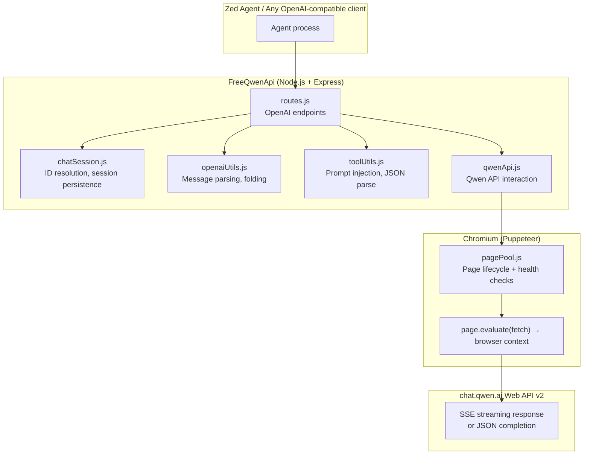
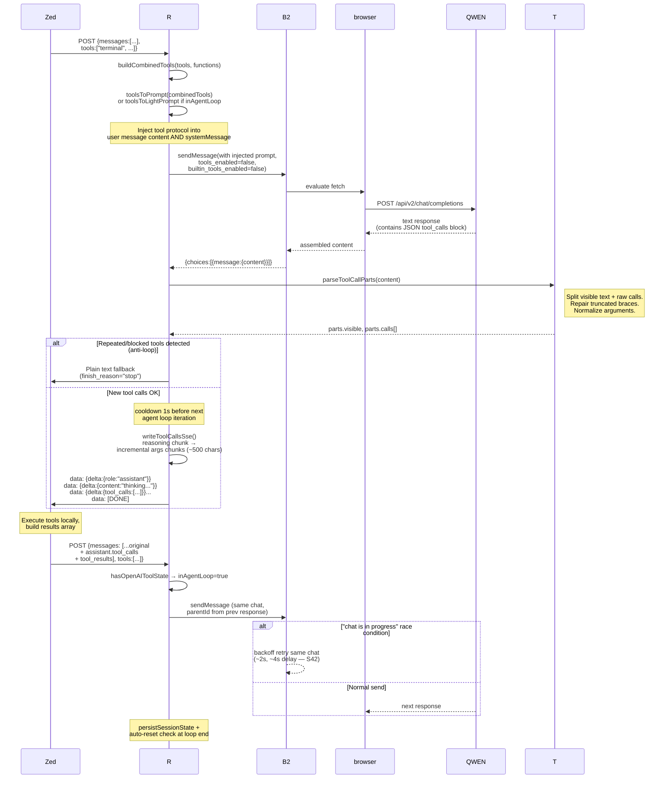

# 02 — Architecture

## High-level overview

FreeQwenApi is a browser-based proxy that replaces the Qwen Chat web account with a local OpenAI-compatible API endpoint (`localhost:3264`). It emulates Qwen API calls via JavaScript `fetch` inside Puppeteer-controlled Chromium pages.



## Request lifecycle — normal (no tools)

1. Client sends `POST /chat/completions` with OpenAI messages array
2. routes.js resolves `effectiveChatId` → `qwenChatId` via layered chat ID resolution (S03)
3. Message prepared: system message extracted, tool prompt injected if applicable (S04)
4. History folded when >60 messages or force-fold threshold reached (S10)
5. qwenApi.js sends payload via Puppeteer `page.evaluate(fetch)` to Qwen v2 API (S14)
6. SSE stream assembled, chunks written back as OpenAI-compatible data: events
7. Session state persisted (chat ID mapping, parentId tracking)

```mermaid
sequenceDiagram
    participant Zed as Client<br/>(Zed Agent)
    participant R as routes.js
    participant C as chatSession.js
    participant B2 as qwenApi.js
    browser as pagePool + evaluate
    QWEN as chat.qwen.ai API

    Zed->>R: POST /chat/completions<br/>{messages, model, stream:true}

    R->>C: resolveQwenChatId(effectiveChatId, model)
    Note right of C: 1. chatIdMap lookup<br/>2. modelDefaultChats fallback<br/>3. create new chat if needed
    C-->>R: qwenChatId (resolved)

    R->>B2: sendMessage(content, model, qwenChatId,<br/>parentId, systemMessage)

    B2->>browser: pagePool.getPage() + evaluate fetch
    browser->>QWEN: POST /api/v2/chat/completions

    QWEN-->>browser: SSE stream chunks
    Note right of browser: assemble content from<br/>delta.choices[0].delta.content

    browser-->>B2: {choices:[{message:{content}}]}
    B2-->>R: response.data

    R->>Zed: data: {"id":"...","object":"chat.completion.chunk", ...}<br/>data: [DONE]

    R->>C: persistSessionState(result, chatId)
```

## Request lifecycle — tool calling (agent loop)

When tools are present in the request:

1. Combined tools built from `tools[]` or `functions[]` array
2. Tool prompt injected into user message content via `applyToolPrompt()` + prepend to last text part (S20)
3. Qwen's internal tools disabled at payload level (no web search, no code interpreter — S18)
4. Response captured fully (not streamed), parsed for JSON tool_calls block
5. If tool calls found → write as incremental SSE deltas with reasoning prefix chunk first
6. Anti-loop checks: repeated/blocked tools blocked before delivery (S26)
7. Client executes tools, sends results back as `role:"tool"` messages
8. Next request detected as "in agent loop" — light prompt variant used



## Chat ID resolution (layered fallback)

Order of priority for determining which Qwen chat to use:

```mermaid
flowchart TD
    A[Client sends<br/>effectiveChatId] --> B{chatIdMap has mapping?}
    B -->|yes| C[return qwenChatId from map]
    B -->|no| D{modelDefaultChats has entry for model?}
    D -->|yes| E[return default chat +<br/>map to effectiveChatId]
    D -->|no| F{effectiveChatId starts with "chat_" ?}
    F -->|yes| G[create new Qwen chat<br/>via createChatV2]
    G --> H[map to effectiveChatId +<br/>save as model default]
    F -->|no| I[qwenChatId = null → sendMessage<br/>auto-creates chat at bottom]

    style C fill:#d4edda
    style E fill:#fff3cd
    style H fill:#cfe2ff
    style I fill:#f8d7da
```

## Error retry policy

| Error type | Strategy | Preserves parentId? | Preserves chatId? | Max attempts |
|---|---|---|---|---|
| `parent_id.*not exist` | Retry same chat, reset parentId to null | No (null) | Yes | 1 |
| `chat_not_exist` / `/not exist/i` | Create new chat via createChatV2, parentId=null | No (null) | No (new) | 1 |
| HTTP 503 overload/CAPTCHA | Backoff retry (5s → 10s per attempt), same chat+parentId | Yes | Yes | MAX_RETRY_COUNT |
| `"chat is in progress"` | Wait + retry **same** chat with same parentId | Yes | Yes | 3, then escalate to new-chat fallback |
| `FAIL_SYS_USER_VALIDATE` (CAPTCHA) | Show visible browser, wait for user Enter, restart headless, retry same request preserving parentId + chatId | Yes | Yes | 2 |

## CAPTCHA resolution flow (S48)

Qwen added a slider CAPTCHA (`FAIL_SYS_USER_VALIDATE`) that returns HTTP 200 with JSON error body containing `"action=captcha&punchCpatcha="...`. The response may claim `content-type: text/event-stream` but send either:
1. Immediate JSON error (detected via non-SSE parser)
2. Empty stream that blocks forever — reader would hang for 60s until CDP timeout, deadlocking the page pool

**Detection:** `parseNonSseCompletionBody()` detects `ret["FAIL_SYS_USER_VALIDATE"]` or `/captcha|punish/i` in body → maps to HTTP 503.

**Resolution (first attempt only):**
1. `handleApiError(503)` calls `resolveCaptchaChallenge()` from `auth.js`
2. Chromium restarts in **visible headed mode**
3. Opens `chat.qwen.ai` page where slider CAPTCHA appears
4. User drags slider, waits for Enter prompt
5. Token + session saved → browser restarts headless → original request retries with fresh token
6. If resolver already running or fails → fallback to 2 backoff attempts (5s/10s) before final error.

**Guard against loops:** `_captchaResolverRunning` flag prevents multiple concurrent CAPTCHA resolvers from infinite-restarting Chromium.

## Stream reader hang prevention (S48)

Qwen sometimes sends `text/event-stream` header but holds connection open or returns empty stream when overload protection triggers. Reader in `page.evaluate()` blocks CDP for 1 minute, deadlocking the page pool.

**Fix:** All SSE reader loops now use `Promise.race(reader.read(), timeout)` with a 5s first-chunk deadline and per-chunk timeouts. If no chunk arrives:
- Node path: falls back to body re-parse as JSON error → status 503
- Browser evaluate path: exits loop with accumulated content or triggers CAPTCHA resolver

S42 fix: "in progress" retries wait 2s/4s before re-sending to the SAME chat. Only falls back to creating a new chat after all same-chat retries exhausted. Old behavior created a fresh chat immediately which broke tool-calling context continuity.
