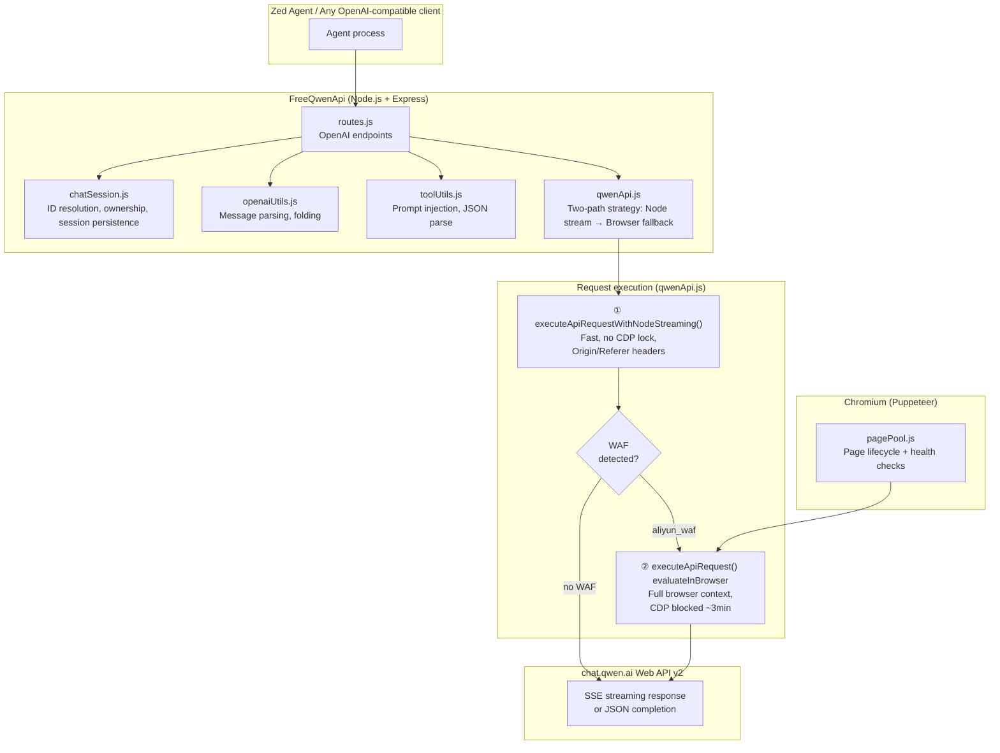
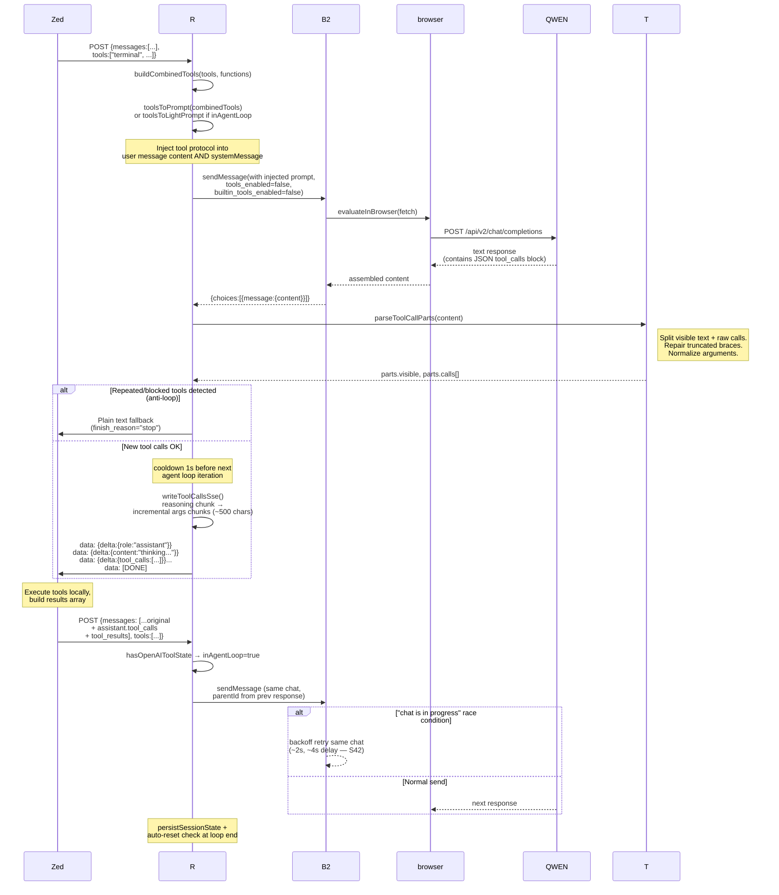
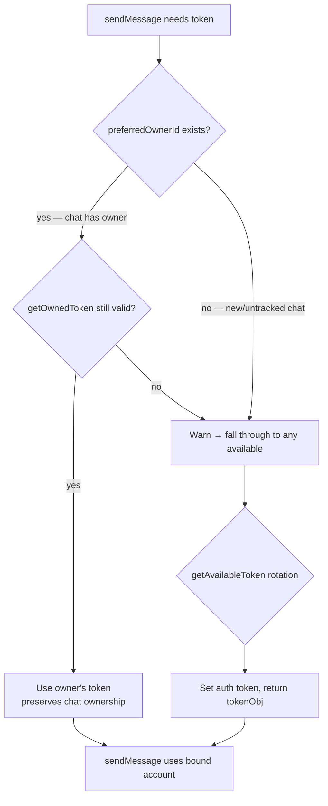

# 02 — Architecture

## High-level overview

FreeQwenApi is a browser-based proxy that replaces the Qwen Chat web account with a local OpenAI-compatible API endpoint (`localhost:3264`).

### Two-path strategy (S59)

API requests use **Node.js streaming as the primary path** via `executeApiRequestWithNodeStreaming()`. This is fast, doesn't block CDP connections, and streams chunks directly to clients with proper Origin/Referer headers that bypass most WAF checks.

Browser-evaluate (`evaluateInBrowser`) activates **only when Node.js detects Aliyun WAF markers** in the response. Before browser fallback: validates page hostname → navigates to chat.qwen.ai if needed + re-extracts token from localStorage.

Both paths converge into shared `resolveWithRetry()`-style error handling — single retry/error logic handles CAPTCHA, rate limiting, and "chat not exist" recovery for both Node.js and browser responses.



## Two-path execution (S59)

### Path 1: Node.js Streaming (Primary)

`executeApiRequestWithNodeStreaming()` sends the request via global `fetch()` with browser-like headers (`Origin`, `Referer`, `Sec-Fetch-*`, `User-Agent`). This path:
- **Does NOT lock CDP** — no Puppeteer page blocking during generation
- Streams chunks directly to the client via `onChunk` callback
- Handles SSE parsing, empty-stream fast-fail (15s timeout), and non-SSE error detection
- Bypasses most WAF checks with proper headers (~90%+ of requests succeed this way)

### Path 2: Browser Evaluate (Fallback)

Activated ONLY when Node.js response contains `aliyun_waf` markers:
- Validates page hostname → navigates to chat.qwen.ai if needed
- Re-extracts token from localStorage after navigation
- Runs full `evaluateInBrowser(fetch)` with SSE reader inside Chromium tab
- Locks CDP for up to 3 minutes (SSE reader abort timeout)

**Before S59:** All requests went through browser-evaluate, blocking CDP for the entire generation duration. This caused Zed Agent to timeout when fetch failed inside browser context.

### Shared Error Handling

Both paths converge into a single response handler that processes CAPTCHA, rate limiting, "parent_id not exist", "chat not exist" retries with consistent backoff logic.

## Request lifecycle — normal (no tools)

1. Client sends `POST /chat/completions` with OpenAI messages array
2. routes.js resolves `effectiveChatId` → `qwenChatId` via layered chat ID resolution (S03)
3. **Account binding**: proxy looks up which account owns this Qwen chat (`getChatTokenOwner`). If owner exists, uses that token exclusively. Without ownership = "not exist" errors on rotation.
4. Message prepared: system message extracted, tool prompt injected if applicable (S04)
5. History folded when >60 messages or force-fold threshold reached (S10)
6. **qwenApi.js two-path execution (S59)**:
   - Path 1: `executeApiRequestWithNodeStreaming()` — fast Node.js fetch with Origin/Referer headers
   - Path 2 (WAF fallback): `executeApiRequest(page)` — browser-evaluate if WAF blocks path 1
7. SSE stream assembled, chunks streamed back as OpenAI-compatible `data:` events
8. Session state persisted (chat ID mapping, parentId tracking)

```mermaid
sequenceDiagram
    participant Zed as Client<br/>(Zed Agent)
    participant R as routes.js
    participant C as chatSession.js
    B2 as qwenApi.js
    browser as pagePool + evaluateInBrowser
    QWEN as chat.qwen.ai API

    Zed->>R: POST /chat/completions<br/>{messages, model, stream:true}

    R->>C: resolveQwenChatId(effectiveChatId, model)
    Note right of C: 1. chatIdMap lookup<br/>2. modelDefaultChats fallback<br/>3. create new chat if needed
    C-->>R: qwenChatId (resolved)

    R->>C: getChatTokenOwner(qwenChatId)
    C-->>R: preferredOwnerId (or null)

    R->>B2: sendMessage(content, model, qwenChatId,<br/>parentId, systemMessage, preferredOwnerId)

    B2->>B2: resolveAuthToken(preferredOwnerId)<br/>→ use owner's token first
    Note right of B2: Prevents cross-account<br/>"not exist" errors on rotation

    B2->>browser: pagePool.getPage() +<br/>evaluateInBrowser(fetch)
    Note over browser: Runs fetch INSIDE Chromium tab.<br/>Aliyun WAF sees legitimate origin.<br/>SSE streams for up to 5 min.
    browser->>QWEN: POST /api/v2/chat/completions

    QWEN-->>browser: SSE stream chunks (in-browser)
    Note right of browser: assemble content from<br/>delta.choices[0].delta.content

    browser-->>B2: {choices:[{message:{content}}]}
    B2-->>R: response.data

    R->>Zed: data: {"id":"...","object":"chat.completion.chunk", ...}<br/>data: [DONE]

    R->>C: persistSessionState(result, chatId)
```

## Request lifecycle — tool calling (agent loop)

When tools are present in the request:

1. Combined tools built from `tools[]` or `functions[]` array
2. Tool prompt injected into user message content via `applyToolPrompt()` + prepend to last text part (S20)
3. Qwen's internal tools disabled at payload level (no web search, no code interpreter — S18)
4. Response captured fully (not streamed), parsed for JSON tool_calls block
5. If tool calls found → write as incremental SSE deltas with reasoning prefix chunk first
6. Anti-loop checks: repeated/blocked tools blocked before delivery (S26)
7. Client executes tools, sends results back as `role:"tool"` messages
8. Next request detected as "in agent loop" — light prompt variant used



## Chat ID resolution (layered fallback)

Order of priority for determining which Qwen chat to use:

```mermaid
flowchart TD
    A[Client sends<br/>effectiveChatId] --> B{chatIdMap has mapping?}
    B -->|yes| C[return qwenChatId from map]
    B -->|no| D{modelDefaultChats has entry for model?}
    D -->|yes| E[return default chat +<br/>map to effectiveChatId]
    D -->|no| F{effectiveChatId starts with "chat_" ?}
    F -->|yes| G[create new Qwen chat<br/>via createChatV2]
    G --> H[setChatTokenOwner → bind to current account]
    H --> I[map to effectiveChatId +<br/>save as model default]
    F -->|no| J[qwenChatId = null → sendMessage<br/>auto-creates chat at bottom]
```

### Account-to-chat ownership binding (S53+)

When `createChatV2()` creates a new Qwen chat, it calls `setChatTokenOwner(createdChatId, tokenObj.id)`. This binds the chat to the specific account that created it.

On subsequent messages, `sendMessage()`:
1. Resolves proxy-chat-id → real Qwen ID via `getChatIdFromMap()`
2. Looks up owner via `getChatTokenOwner(realQwenChatId)`
3. Passes `preferredOwnerId` to `resolveAuthToken()` — which tries the owner's token first before falling back to any available token

**Without this binding:** Token rotation picks random account → Qwen rejects messages on another account's chat with "not exist" errors.

When a stale Qwen ID is detected ("not exist" error), `invalidateQwenChatId()` clears ALL maps INCLUDING the ownership mapping, preventing zombie references.

## Timeout architecture (S53+)

```mermaid
graph LR
    subgraph Client["Client request"]
        C[POST /chat/completions]
    end

    subgraph Proxy["Timeout layers"]
        W1[withRequestTimeout<br/>REQUEST_TIMEOUT_MINUTES × 60s<br/>(default: 5 min)]
        W2[evaluateInBrowser timeout<br/>apiTimeoutMs = max(RT×60+30s, 180s)]
    end

    subgraph Browser["CDP layer"]
        PT[protocolTimeout in browser.js<br/>max(env, RT + 5) × 60 × 2<br/>(default: ~180 min)]
    end

    C --> W1 --> W2 --> PT
```

**Order matters:** `PT > evaluateInBrowser timeout > REQUEST_TIMEOUT_MINUTES`. Inner layers must be wider than outer wrappers so timeouts fire from the outside in, not randomly.

| Layer | Constant | Default Value | Purpose |
|-------|----------|---------------|---------|
| Proxy wrapper | `REQUEST_TIMEOUT_MINUTES` | 5 min | Global request deadline via AbortController |
| Browser evaluate | `apiTimeoutMs` | max(5×60+30, 180) = 330s | Timeout for `page.evaluate(fetch)` — long SSE inside browser |
| **SSE reader abort** (S57) | `abortTimeoutMs` | **3 min** (inside evaluateInBrowser) | **Aborts reader if Qwen holds connection open >3min. Returns partial content instead of hanging CDP for 5m+** |
| CDP protocol | `protocolTimeout` | (5+5) × 60 × 2 ≈ 180 min | Puppeteer connection limit — prevents "Protocol timeout" during long generations |

## Error retry policy

| Error type | Strategy | Preserves parentId? | Preserves chatId? | Max attempts |
|---|---|---|---|---|
| `parent_id.*not exist` | Retry same chat, reset parentId to null | No (null) | Yes | 1 |
| `chat_not_exist` / `/not exist/i` | Create new chat via createChatV2 **with same token**, parentId=null, gated by `retryCount === 0` | No (null) | No (new) | 1 |
| `"chat is in progress"` | Wait + retry **same** chat with same parentId | Yes | Yes | 3, then escalate to new-chat fallback |
| `FAIL_SYS_USER_VALIDATE` (Qwen CAPTCHA) | Show headed browser, inject token, wait for user, restart headless, retry same request | Yes | Yes | 2 |
| Aliyun WAF (`aliyun_waf` in body) | Same resolver as Qwen CAPTCHA — HTTP 200 HTML page with `aliyun_waf` meta tags detected across all response paths | Yes | Yes | 2 |

## CAPTCHA / WAF challenge resolution flow (S48, refactored S52)

**Two challenge types detected by the same resolver (via `isCaptchaChallenge()`):**

### Qwen CAPTCHA (`FAIL_SYS_USER_VALIDATE`)
Qwen added a slider CAPTCHA that returns HTTP 200 with JSON error body containing `"action=captcha&punchCpatcha="...`. The response may claim `content-type: text/event-stream` but send either:
1. Immediate JSON error (detected via non-SSE parser)
2. Empty stream that blocks forever — reader would hang for 60s until CDP timeout, deadlocking the page pool

**Detection:** `parseNonSseCompletionBody()` (Node.js) or `parseNonSseInBrowser()` (inside evaluate callback) detect `ret["FAIL_SYS_USER_VALIDATE"]` or `/captcha|punish/i` in body → map to HTTP 503.

> **⚠ Browser context constraint (S58):** Functions inside `page.evaluate()` run in Chromium's JS engine, NOT Node.js. Puppeteer serializes only the callback body — external function references throw `ReferenceError: xxx is not defined`. Hence `parseNonSseInBrowser()` must be defined INSIDE the evaluate callback for proper serialization.

### Aliyun WAF (`aliyun_waf`)
Aliyun Web Application Firewall returns an HTML page with `<meta name="aliyun_waf_..">` tags instead of the expected SSE/JSON response. This is a browser-level verification that blocks API requests until the user passes the challenge in a headed browser.

**Detection (3 paths):**
- **Browser evaluate path:** Checks `body.includes("aliyun_waf")` before falling through to generic error
- **Node.js streaming path:** `parseNonSseCompletionBody()` detects via `isCaptchaChallenge(body)`
- **createChatV2 path:** Pre-checks content-type; if not JSON and body contains `aliyun_waf`, returns `{ isCaptcha: true }`

**Resolution (centralized in `resolveCaptchaAndRetry()` since S52):**
1. `sendMessage()` detects challenge via `isCaptchaChallenge(response.errorBody)` — triggers same resolver for both Qwen CAPTCHA and Aliyun WAF
2. CLI message differs by type: "ЗАПРОШЕНА КАПЧА" vs "ЗАПРОШЕНА ВАРИФИКАЦИЯ WAF"
3. `resolveCaptchaAndRetry()` handles full cycle:
   - Save JWT token from `getAuthToken()` before shutdown
   - `shutdownBrowser(headless)` + 2s delay
   - `initBrowser(visible=true, skipManualAuth=true)` — skip blocking auth flow
   - `page.goto(CHAT_PAGE_URL)` with `waitUntil: "domcontentloaded"` (S52 fix: was `networkidle2`, caused 60s timeout)
   - `evaluateInBrowser(() => localStorage.setItem("token", savedToken))` — JWT inject for instant Qwen auth
   - Wait for user Enter in console (slider CAPTCHA / WAF verification)
   - 3s delay → re-extract token from localStorage → update in proxy
   - `shutdownBrowser(visible)` + 2s delay → `initBrowser(headless=true)`
   - Retry `sendMessage(retryCount + 1)` preserving parentId + chatId
4. If resolver already running or fails → fallback to 2 backoff attempts (5s/10s) before final error.

**SIMULATE_CAPTCHA test mode (S52):** Set `SIMULATE_CAPTCHA=true` in `.env` or environment. Triggers exactly once per process (`_captchaSimulated` flag) on first request, returning `{ success: false, isCaptcha: true }`. Allows testing full resolver cycle without waiting for real Qwen CAPTCHA.

**Guard against loops:** `_captchaResolverRunning` flag prevents multiple concurrent CAPTCHA resolvers from infinite-restarting Chromium.

## Stream reader hang prevention (S48)

Qwen sometimes sends `text/event-stream` header but holds connection open or returns empty stream when overload protection triggers. Reader in `page.evaluate()` blocks CDP for a long time, deadlocking the page pool.

**Fix:** All SSE reader loops now use `Promise.race(reader.read(), timeout)` with per-chunk timeouts. If no chunk arrives:
- Browser evaluate path: exits loop with accumulated content or triggers CAPTCHA resolver

## Account management (S53+)

### Token resolution flow (`resolveAuthToken`)



### Add account flow (`addAccountInteractive`)

1. Clear stale global `auth_token.txt` to prevent mixing accounts
2. Launch visible Chromium browser (`initBrowser(true, skipManualAuth=true)`)
3. Navigate to chat.qwen.ai
4. Wait for user to log in (manual), then press Enter
5. Extract token via `extractAuthToken(ctx, forceRefresh=true)`
6. Save: per-account `session/accounts/{id}/token.txt` + global `auth_token.txt`
7. Update tokenManager list (`loadTokens()` → push new entry → `saveTokens()`)
8. Shutdown visible browser → restart headless

### Relogin account flow (`reloginAccountInteractive`)

1. Show all accounts from `loadTokens()`, let user pick by number (any status, not just invalid)
2. Shutdown current browser
3. Launch visible Chromium
4. **Try to restore session first:** load `session/accounts/{id}/cookies.json` → `ctx.setCookie(...)`
5. Navigate to chat.qwen.ai — if cookies alive, user is already logged in
6. If cookies dead: login page appears → user authenticates manually → press Enter
7. Extract token + save new cookies (`saveSession(ctx)`)
8. Update tokenManager list with fresh token
9. Shutdown visible browser → restart headless
