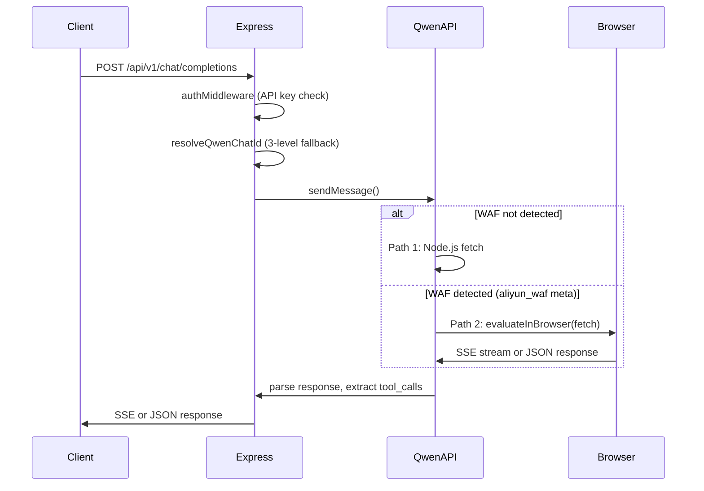
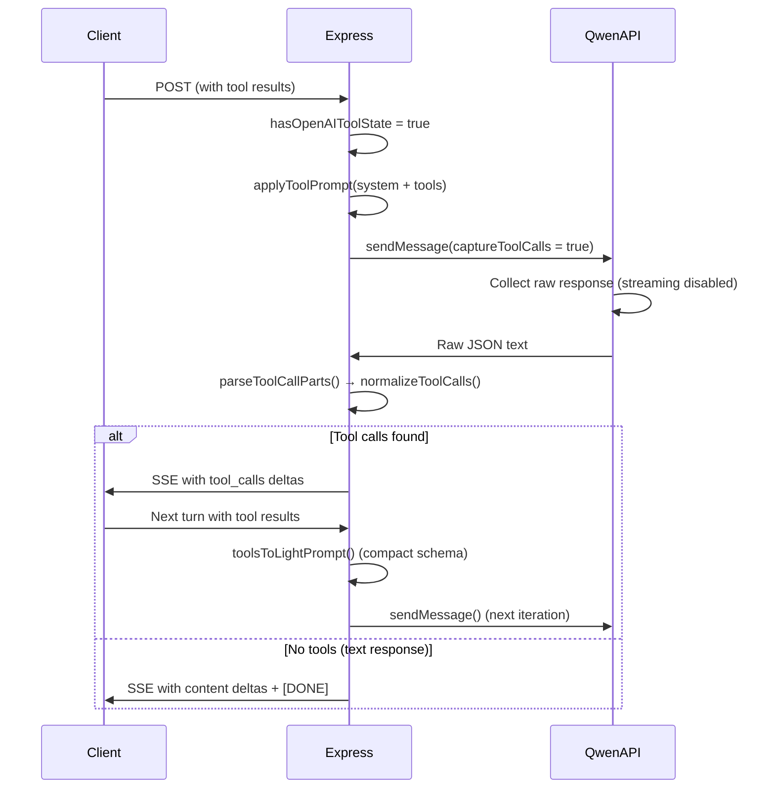

# 02 — Architecture (Post-S61 Multi-Provider)

## High-level overview

```
index.js ─── dispatcher (child_process.fork)
    ├── Qwen:    Chromium pool, browser-evaluate fetch, multi-account token rotation, CAPTCHA/WAF resolver
    └── DeepSeek: Cookie auth via Puppeteer one-shot login, PoW solving, direct HTTP fetch

shared/ ─── config.js, logger/index.js, utils/prompt.js
```

Each service runs as isolated Node.js process. Shared utilities imported via relative paths (`../../../shared/logger/...`).

## Two-path strategy (Qwen only)

Qwen uses two execution paths due to **Aliyun WAF**:

1. **Path 1 — Node.js fetch**: Used only for `chats/new` (WAF allows it with Bearer token).
2. **Path 2 — Browser evaluate** (primary for `chat/completions`): XHR → `fetch()` in main world via page's native fetch wrapped by Aliyun WAF SDK. No `Authorization: Bearer` header. Auth via cookies (`credentials: "include"`). Navigation uses `networkidle0` + 2s pause for WAF SDK async load.



## Request lifecycle — normal flow (no tools)

### Qwen

1. POST `/api/v1/chat/completions` → Express router
2. **Auth middleware**: validates `Authorization: Bearer` against `Authorization.txt`
3. **Message parsing**: `parseOpenAIMessages()` extracts system message + user content
4. **Chat ID resolution**: `resolveQwenChatId()` — layered fallback:
   - `chatIdMap` (cached mapping)
   - `modelDefaultChats` (per-model default)
   - `createChatV2()` (new Qwen chat)
5. **Token selection**: `getAvailableToken()` — round-robin across valid tokens
6. **Payload construction**: `buildPayloadV2()` with `feature_config`
7. **Send via two-path strategy** → SSE stream delivered with `STREAMING_CHUNK_DELAY` (20ms) in 16-code-point chunks
8. `[DONE]` delimiter sent when finish_reason received; 3min SSE reader abort returns partial content on timeout

### DeepSeek

1. POST `/api/v1/chat/completions` → Express router
2. **Session validation**: `hasValidSession()` checks stored cookies + authData
3. **Message folding**: history appended as role-prefixed lines (last user message only)
4. **Proxy init on first request**: `initBrowserPage()` restores cookies + localStorage, enables CDP capture
5. **PoW solving**: fetch challenge from `/create_pow_challenge`, solve via WASM (`js-sha3`), send as `X-DS-PoW-Response`
6. **API call**: direct `fetch()` with cookie string + PoW header
7. **SSE parsing**: extract `{ p, v }` chunks from upstream, send as OpenAI delta chunks

## Request lifecycle — tool calling (agent loop)

### Qwen



Key points:
- `captureToolCalls = true` disables normal streaming callback
- Response collected entirely, parsed via `parseToolCallParts()` with brace repair
- Anti-loop: `getRepeatedToolCalls()` tracks name+args signature; `>TOOL_CALL_RESET_THRESHOLD` repeats → force fold via `buildStatelessTranscript()`
- Cooldown 1s between iterations; same-chat backoff ~2s/4s up to 3 attempts before fresh chat fallback

### DeepSeek

Native OpenAI `tools[]` format supported by underlying API. No prompt injection or JSON parse roundtrip needed — proxy passes messages through as-is.

## Chat ID resolution (Qwen only)

`resolveQwenChatId()` flow:

1. **chatIdMap** → returns cached qwenChatId if conversation_id mapped
2. **modelDefaultChats** → per-model default, auto-created when no `chat_XXXXX` provided
3. **createChatV2()** → creates new Qwen chat via browser evaluate (Node.js fetch fallback). Saves to both maps + binds token owner (`setChatTokenOwner()`)

On `"chat_not_exist"` error (`/not exist/i` in details): `invalidateQwenChatId()` cleans ALL maps → retry exactly once with fresh chat.

DeepSeek: simple in-memory `Map<conversation_id → session_id>` in `chat.js`. No creation endpoint needed.

## Timeout architecture

| Layer | Scope | Default | Mechanism |
|-------|-------|---------|-----------|
| Request wrapper | Full HTTP request | 5 min | `withRequestTimeout()` — Promise.race vs setTimeout |
| SSE reader abort | SSE stream inside browser | 3 min | `setTimeout` + `reader.cancel()` → partial content |
| CDP protocol | Puppeteer page.evaluate | ~5.5 min | `protocolTimeout` synced from `REQUEST_TIMEOUT_MINUTES` |

DeepSeek: `DEEPSEEK_REQUEST_TIMEOUT` env var (default 5 min). `AbortController` signal passed to `fetch()`.

## Error retry policy (Qwen)

| HTTP Status | Classification | Action |
|-------------|---------------|--------|
| 401 | Unauthorized | Rotate token, mark invalid |
| 429 | RateLimited | Mark with `resetAt` + 24h cooldown |
| 503 / CAPTCHA | Overload | `resolveCaptchaAndRetry()` or backoff (5s→10s, max 3 retries) |
| Generic | Unknown | Return error JSON with details |

## CAPTCHA / WAF challenge resolution (Qwen)

`isCaptchaChallenge()` detects both Qwen slider (`FAIL_SYS_USER_VALIDATE`) and Aliyun WAF (HTML with `aliyun_waf` meta tags).

Flow: save JWT → shutdownBrowser → initBrowser(visible) → user solves slider → Enter → restart headless → retry original request.

Protected by `_captchaResolverRunning` loop guard. `SIMULATE_CAPTCHA=true` env for testing.

## Account management

### Qwen

- **Add account**: `addAccountInteractive()` — clears old token, launches visible browser, waits for manual login, saves token per-account
- **Relogin**: `reloginAccountInteractive()` — tries saved cookies first, falls back to manual login
- **Remove**: `removeAccountInteractive()` — deletes token + account directory
- **Binding**: `chatTokenOwner` Map binds chats to creating account — prevents cross-account "not exist" errors
- **Token Manager**: `tokenManager.js` — round-robin rotation, rate-limit tracking, invalidation

### DeepSeek

- **Auth**: `addAccountInteractive()` — launches visible Puppeteer with CDP capture, extracts cookies + PoW data from 3 sources (JS interceptors, CDP network, page.evaluate)
- **Session**: stored as `deepseek_accounts.json` (cookies + authData + storage)
- **Clear**: `clearSession()` removes account from JSON array
