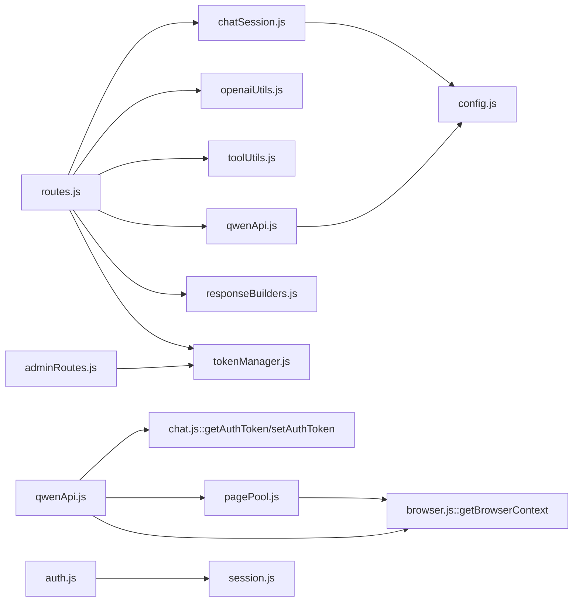

# 03 — Code Map

## Module layout

```
src/
├── index.js                        # Entry point: Express app, browser init, auth flow
│   ├── puppeteer launch (browser.js)
│   ├── express router (routes.js + adminRoutes.js)
│   └── graceful shutdown hooks
│
├── config.js                       # Constants: timeouts, limits, URLs, server settings
│
├── api/                            # API layer — OpenAI-compatible endpoints + Qwen interaction
│   ├── routes.js                   # Main route handler. chatId resolution, streaming/non-streaming paths
│   ├── chatSession.js              # Chat ID map/model defaults, session persistence, force-folding logic
│   ├── openaiUtils.js              # Message parsing/normalization, tool state detection, folding helpers
│   ├── responseBuilders.js         # SSE chunk construction: tool_call delivery, streaming fallback
│   ├── qwenApi.js                  # Qwen API interaction: sendMessage, retry policy, error handling
│   │   ├── buildPayloadV2() — construct /api/v2/chat/completions payload
│   │   │   ├── parseNonSseCompletionBody() — detect ret[], code, captcha/overload in non-SSE 200 responses (S43)
│   │   │   ├── executeApiRequest() — browser.evaluate fetch with reader timeout guard against stream hangs (S48)
│   │   │   └── handleApiError() — classify & route errors to retry paths
│   │   │       ├─ 401 → rotate token, retry
│   │   │       ├─ 429 RateLimited → mark rate-limited, try next token
│   │   │       ├─ 503 overload/CAPTCHA → trigger resolveCaptchaChallenge or backoff retry (S48)
│   │   │       └─ generic → return error with details
│   ├── chat.js                     # Token state + model/key loaders. Re-exports from qwenApi.js, pagePool.js
│   ├── toolUtils.js                # Tool prompt injection & parseToolCallParts (JSON extraction)
│   │   ├── toolsToPrompt() / toolsToLightPrompt() — full vs compact schema injection
│   │   ├── normalizeToolCalls() — argument normalization + repair truncated braces
│   │   └── getRepeatedToolCalls() / getBlockedToolCalls() — anti-loop guards (S26)
│   ├── fileRoutes.js               # File upload STS token, chat history GET/POST endpoints
│   ├── fileUpload.js               # Alibaba Cloud OSS upload via STS credentials
│   ├── modelMapping.js             # External → internal model name mapping table
│   ├── projectContext.js           # Anti-hallucination: FS scan → compact tree injected into system msg
│   ├── tokenManager.js             # Token rotation, account status tracking (OK/RATELIMIT/INVALID)
│   └── timeoutWrapper.js           # withRequestTimeout() — Promise.race wrapper for REQUEST_TIMEOUT_MINUTES
│
├── browser/                        # Puppeteer + Chromium management
│   ├── browser.js                  # Puppeteer launch config, stealth evasion, protocolTimeout setting (S41)
│   ├── pagePool.js                 # Page pool: health-check checkout/release, idle TTL GC (S31)
│   │   ├── getPage() — acquire page from pool with evaluate timeout health check
│   │   ├── releasePage() — return to pool or close if invalid
│   │   └── _runGC() / _ensureGC() — lazy-started periodic GC at PAGE_GC_INTERVAL_MS (S31)
│   ├── auth.js                     # Auth verification + CAPTCHA resolution
│   │   ├── checkAuthentication() — detect login needed, extract token after manual auth
│   │   ├── checkVerification() — page-level verification prompt
│   │   └── resolveCaptchaChallenge() — handle Qwen slider CAPTCHA by restarting Chromium headed (S48)
│   └── session.js                  # Cookie/token extraction + persistence (localStorage via page.evaluate)
│
├── logger/                         # Logging infrastructure
│   └── index.js                    # Winston-based structured logging. logInfo/logWarn/logError/logDebug
│
└── utils/                          # Cross-cutting utilities
    ├── branding.js                 # ForgetMeAI watermark injection into messages
    ├── prompt.js                   # Prompt formatting helpers (multiline, dedent)
    └── accountSetup.js             # Account configuration CLI logic

tests/unit/                         # Node.js built-in test runner (npm test)
├── toolUtils.test.js               # parseToolCallParts, normalizeToolCalls, toolsToPrompt variants
├── chatSession.test.js             # resolveQwenChatId helpers, idempotency cache, session detection
└── openaiUtils.test.js             # Message parsing, combinedTools building, anti-loop guards
```

## Key data objects

### Payload v2 (sent to Qwen API)

```typescript
interface PayloadV2 {
  stream: true;                    // always streaming
  incremental_output: true;
  chat_id: string;                 // resolved qwenChatId
  chat_mode: "normal";
  messages: [{                     // single user message
    fid: string;                   // UUID for this turn
    parentId?: string | null;      // response ID from previous assistant reply
    parent_id?: string | null;     // alias (both required)
    role: "user";
    content: string | Array<{type, text|image}>;  // tool prompt prepended if applicable
    chat_type: "t2t";
    sub_chat_type: "t2t";
    models: [string];             // mapped model name (e.g. qwen3-coder-plus)
    feature_config: {              // Qwen builtin tools disabled at payload level (S18, S20)
      auto_search: false;
      web_search: false;
      code_interpreter: false;
      browser_enabled: false;
      plugins_enabled: false;
      ...
    };
  }];
  model: string;                   // target model
  parent_id?: string | null;       // top-level parentId (for v2 API routing)
  system_message?: string;         // tool protocol instructions appended here
}
```

### Session state (in-memory, per-model defaults + chat maps)

| Store | Purpose | GC policy |
|-------|---------|-----------|
| `modelDefaultChats` Map<model → {chatId, parentId, toolCallCount, inAgentLoop}> | One "default" Qwen chat per model — auto-created and reused for new conversations | 24h TTL (S40 GC) |
| `chatIdMap` Map<effectiveChatId → qwenChatId> | Maps generated `chat_XXXXX` IDs to real Qwen internal UUIDs | Hard cap 500, evict oldest on spike (S40) |
| `sessionToChatMap` Map<scopedSessionKey → {chatId, parentId}> | Scoped sessions keyed by IP + User-Agent + conversation_hint hash | Cleared every 10 min GC tick (S40) |
| `idempotencyCache` Map<hash → response> | Prevents Zed retry spam — cache last successful response for 5s TTL | Lazy cleanup >1000 entries; proactive on each tick (S40) |

### Tool call result from parseToolCallParts()

```typescript
interface ParseResult {
  visible: string | null;          // reasoning text extracted before JSON block
  calls: Array<{                   // normalized OpenAI tool_calls format
    id: string;                    // tool_call UUID
    type: "function";
    function: {
      name: string;                // e.g. "terminal", "read_file"
      arguments: string;           // minified JSON (via repair + normalize)
    };
  } | null;                        // null if no valid tool calls found
}
```

## Cross-module dependency graph



## Module size (lines, approximate)

| File | LOC | Notes |
|------|-----|-------|
| routes.js | ~1030 | Main handler. Grew with agent-loop logic (S22, S42). Refactored from 2390 → current via S11-14 splits. |
| qwenApi.js | ~1400 | Qwen API interaction: sendMessage, createChatV2, executeApiRequest variants |
| chatSession.js | ~540 | Chat ID resolution/generation/normalization, session persistence, force-folding |
| pagePool.js | ~290 | Page lifecycle with health checks + GC timer (S13, S31) |
| openaiUtils.js | ~400 | Message parsing, tool state detection, compact builder port from Python fork (S23) |
| responseBuilders.js | ~260 | buildOpenAIToolResponse, writeToolCallsSse with chunk splitting (S29) |
| toolUtils.js | ~500 | Prompt injection, parseToolCallParts (brace repair), anti-loop detection |
| chat.js | ~180 | Token state wrapper + model/key loaders. Grew thin after S14 split. |

## Important constants (from config.js)

```javascript
REQUEST_TIMEOUT_MINUTES = 3         // withRequestTimeout enforcement (S30)
PROTOCOL_TIMEOUT = 8*60s           // puppeteer protocol timeout, aligned > REQUEST_TIMEOUT + buffer (S41)
PAGE_POOL_SIZE = 3                  // soft pool size hint
MAX_ACTIVE_PAGES = 5                // hard limit on concurrent checked-out pages (S31)
PAGE_IDLE_TTL_MS = 5*60s           // idle page eviction TTL (S31)
PAGE_GC_INTERVAL_MS = 60s          // GC run frequency (S31)
EVALUATE_HEALTH_TIMEOUT = 5s       // health check evaluate timeout — prevents page.evaluate hangs
MAX_SCHEMA_LEN = 6000              // tool prompt schema cap in chars (S27)
```
